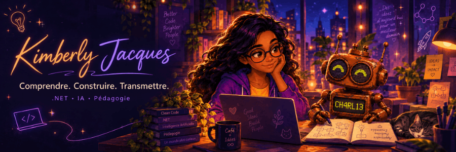

<picture>
  <source media="(prefers-reduced-motion: reduce)" srcset="assets/banner-static.png">
  
</picture>

## Bienvenue dans mon atelier

Moi, c’est **Kimberly**. Ici, je construis les outils que j’aimerais avoir, je teste des idées qui me travaillent et je cherche à comprendre ce qui se cache derrière « ça fonctionne ».

Mon quotidien professionnel tourne autour de .NET, chez **[SoftFluent](https://www.softfluent.fr/)**. Mes projets personnels débordent un peu du cadre : organiser les repas, apprendre autrement, mieux accompagner le travail technique…

Le point commun ? Une petite friction du quotidien qui finit par devenir un projet. Parfois beaucoup plus grand que prévu.

## Ce qui m’occupe en ce moment

Pas des produits parfaits exposés en vitrine : des idées que je construis, que je teste et que je fais évoluer.

### 

**Partir de ce qu’on a réellement dans les placards**, plutôt que d’une recette qui suppose qu’on a déjà tout.

Je relie l’inventaire, les recettes et le planning des repas. Miette vient proposer des pistes, pas décider à ma place : ses suggestions restent soumises à confirmation.

`Blazor` · `.NET 10` · `SQL Server` · `LLM`

*Intégration en cours de validation.*

### 

**Ne pas seulement accumuler des cours** : essayer, expliquer, se tromper et retravailler sa compréhension.

J’en fais un atelier C#/.NET et DevOps où je peux garder mes tentatives et reprendre mes explications. La correction assistée est une piste que j’expérimente, pas une évaluation pédagogique déjà validée.

`C#` · `.NET` · `Ollama`

*Correction assistée en expérimentation.*

### 

**Explorer comment un agent peut aider sans lui confier les décisions à notre place.**

Je construis un cockpit de missions qui garde le contexte et la trace des décisions. Les propositions, les preuves et les autorisations restent séparées : pouvoir suggérer une action ne signifie pas avoir le droit de l’exécuter.

`Blazor` · `Azure DevOps` · `Codex`

*MVP local.*

## Quelques convictions, pas des commandements

> Comprendre avant d’ajouter une abstraction.
>
> Une proposition d’IA n’est pas une décision.
>
> Si personne ne peut reprendre le système derrière moi, la documentation n’est pas un supplément.

## Quelques notes sorties de l’atelier

**De l’herbe fraîche à la migration : AppCat au service des projets legacy**

J’écris aussi pour partager ce que je découvre. Cet article en deux parties, publié chez SoftFluent, explore AppCat au service des projets legacy :

- [Lire la première partie](https://www.softfluent.fr/blog/de-lherbe-fraiche-a-la-migration-appcat-au-service-des-projets-legacy-partie-01/)
- [Lire la deuxième partie](https://www.softfluent.fr/blog/de-lherbe-fraiche-a-la-migration-appcat-au-service-des-projets-legacy-partie-02/)

---

Certains dépôts restent privés. Je peux néanmoins parler des problèmes rencontrés, des choix faits et de ce que j’en retiens, en respectant ce qui doit rester confidentiel.

Un sujet en commun, une question ou une idée à confronter ? [Parlons-en par email](mailto:eldraea@gmail.com) ou sur [LinkedIn](https://www.linkedin.com/in/kimberly-jacques-67233a17b/).
